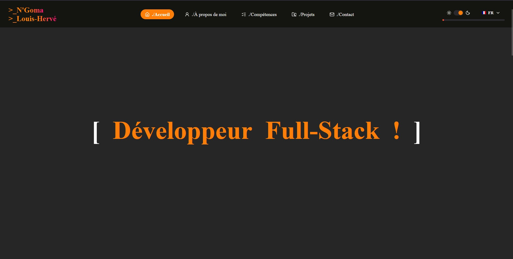
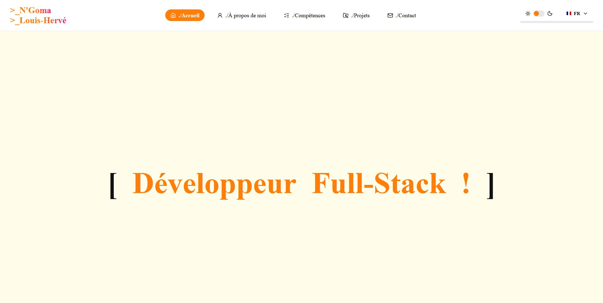

# Portfolio — Hervé N'Goma

Portfolio de développeur Full Stack, réalisé en **React** et **TypeScript** (c'est mon premier projet TypeScript). Il présente mon parcours, mes compétences et six de mes projets.

🔗 **Site en ligne : [herve-ngoma.dev](https://herve-ngoma.dev)**




## Fonctionnalités

- **Trilingue** : français, anglais, portugais (Portugal), avec `<html lang>` et titre de page mis à jour
- **Thème clair / sombre** basé sur des variables CSS
- **Header fixe** avec détection de la section visible, barre de progression du scroll et menu hamburger sur mobile
- **Section Projets** : cartes à onglets (description, technologies, liens), carousel d'images et fenêtre d'agrandissement
- **Formulaire de contact** avec labels flottants, validation, pièces jointes (PDF, images, texte) et envoi d'email via une fonction serverless
- **Protection anti-spam** : champ piège (honeypot), délai minimum, filtre d'adresses jetables, validation refaite côté serveur
- **Responsive** et **accessible** (rôles ARIA, navigation clavier, respect de `prefers-reduced-motion`)
- **Page d'erreur** (404 / 500) dont le code et le message s'adaptent à l'erreur

## Stack technique

| Domaine | Technologies |
|---|---|
| Interface | React, TypeScript, Vite, CSS Modules |
| Routage | React Router |
| Traductions | i18next, react-i18next |
| Icônes | lucide-react, react-country-flag |
| Serveur | Fonction serverless Vercel (`api/contact.ts`), Resend |
| Hébergement | Vercel |
| Outils | pnpm, ESLint |

## Choix techniques

- **Context API** pour le thème et la langue, avec un hook dédié par contexte (`useTheme`, `useLanguage`)
- **Hooks personnalisés** : `useActiveSection` (IntersectionObserver), `useScrollProgress`, `useWordCycle`, `useEyeTracking`
- **Thématisation par `data-theme`** sur `<html>` : un seul jeu de variables CSS par thème, sans logique JavaScript dans les composants
- **Cartes à hauteur constante** : les panneaux d'onglets sont superposés dans la même cellule de grille, la carte prend la hauteur du plus grand
- **Fenêtre d'agrandissement** rendue avec `createPortal`, fermeture par clic extérieur ou touche Échap
- **Validation partagée dans l'esprit** : le navigateur guide l'utilisateur, le serveur revérifie tout (types de fichiers, taille, format d'email)

## Lancer le projet en local

Prérequis : [Node.js](https://nodejs.org) et [pnpm](https://pnpm.io).

```bash
git clone https://github.com/HNGA91/Portfolio_Dev.git
cd Portfolio_Dev
pnpm install
pnpm dev
```

Cela lance le site, **sans** la fonction d'envoi d'email.

### Tester le formulaire de contact

La fonction `api/contact.ts` a besoin de la CLI Vercel et de trois variables d'environnement :

| Variable | Rôle |
|---|---|
| `RESEND_API_KEY` | Clé d'API Resend |
| `CONTACT_TO` | Adresse qui reçoit les messages |
| `CONTACT_FROM` | Expéditeur, par exemple `Portfolio <onboarding@resend.dev>` |

```bash
npm i -g vercel
vercel login
vercel link
vercel env add RESEND_API_KEY development
vercel env add CONTACT_TO development
vercel env add CONTACT_FROM development
vercel dev
```

`vercel dev` télécharge les variables du projet Vercel, il ne lit pas `.env.local`.

## Scripts

| Commande | Action |
|---|---|
| `pnpm dev` | Serveur de développement |
| `pnpm build` | Vérification TypeScript et build de production |
| `pnpm lint` | Analyse ESLint |
| `pnpm preview` | Prévisualisation du build |

## Structure

```
api/              Fonction serverless d'envoi d'email
public/           Fichiers statiques (CV, favicon, image de partage)
src/
├── assets/       Icônes et images des projets
├── components/   Composants réutilisables
├── context/      Contextes thème et langue
├── data/         Compétences et projets
├── hooks/        Hooks personnalisés
├── i18n/         Configuration et fichiers de traduction
├── pages/        Page d'erreur
├── sections/     Sections de la page
├── styles/       Styles globaux et variables
├── types/        Types TypeScript
└── utils/        Fonctions utilitaires
```

## Déploiement

Hébergé sur Vercel. Les trois variables d'environnement sont à définir pour les environnements Production et Preview. Le fichier `vercel.json` redirige les adresses inconnues vers l'application, qui affiche alors la page d'erreur.

## Licence

Tous droits réservés. Les textes, images et le contenu de ce portfolio m'appartiennent.

## Auteur

Louis-Hervé N'Goma — Développeur Full Stack GitHub : @HNGA91